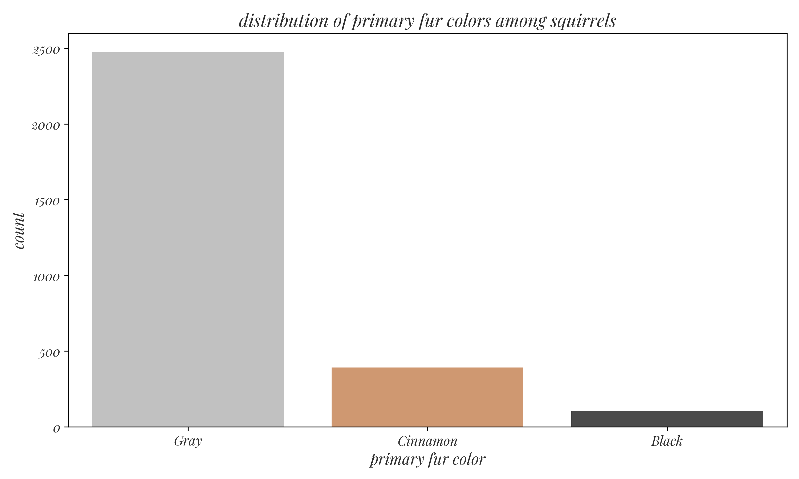
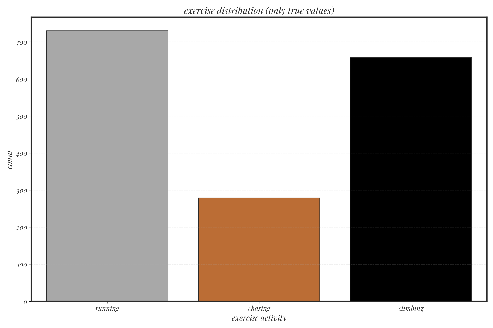
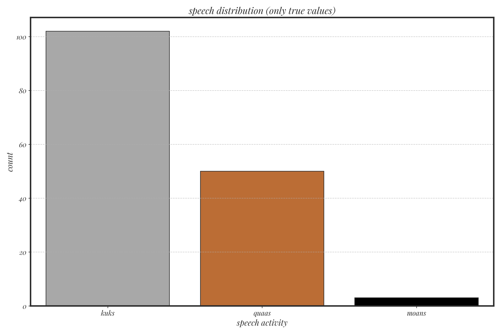
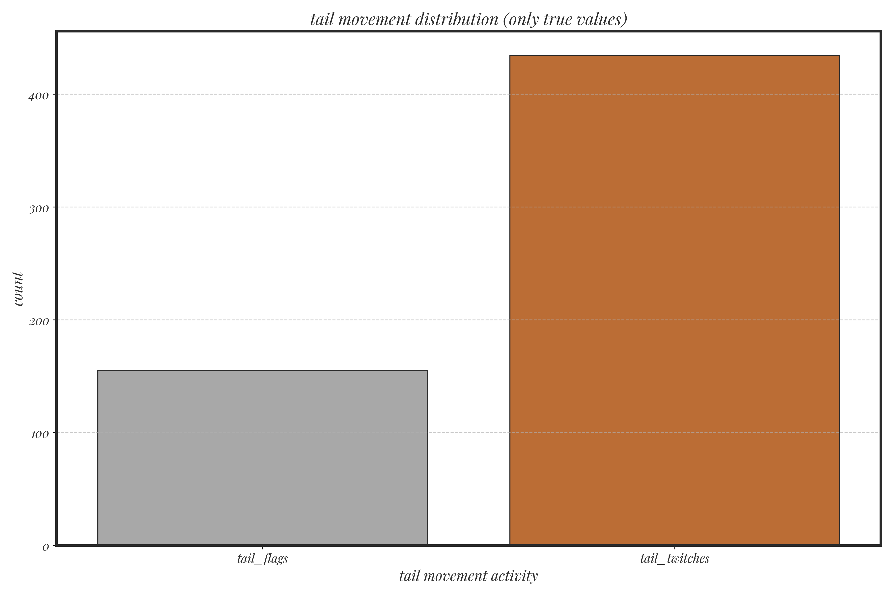

```{r setup, include=FALSE}
library(leaflet)
library(leaflet.extras)
library(leaflet.providers)
library(dplyr)
knitr::opts_chunk$set(echo = TRUE)
```

# Introduction

- **Goal:** Research the location, demographics, and behaviors of squirrels in Central Park, NYC.
- **Data Source:** [The Squirrel Census](https://www.thesquirrelcensus.com/).
- **Key Questions:**
  1. Where are squirrels most concentrated?
  2. What are their primary fur colors?
  3. How do movement patterns differ between AM/PM?
  4. Common activities?
  5. Unique behaviors?

---

# Squirrel Highways

{.center}

This work is inspired by a map titled Squirrel Highways by Dennis Wood, a nondescript map of telephone lines in a suburban neighborhood.{.center}
---

# Methodology

- **Exploratory Questions:**
  1. Concentration patterns.
  2. Fur color distribution.
  3. Movement by time of day.
  4. Activity distributions.
  5. Unique behaviors.

- **Approach:**
  - Interactive heatmaps for spatial data.
  - Bar charts for categorical data.
  - Observational insights.

---

# Squirrel Concentration Patterns

```{r squirrel_concentration_map, echo=FALSE}
# Load the dataset
squirrel_data <- read.csv("location.csv")

# Filter required columns
data_for_map <- squirrel_data %>%
  select(latitude, longitude) %>%
  na.omit()

# Create an interactive leaflet map
leaflet(data = data_for_map) %>%
  addProviderTiles(providers$Stadia.AlidadeSmoothDark, options = providerTileOptions(apiKey = 'd6ac9761-ecc7-41ad-94fa-f24bb7c4bf96')) %>% # Dark basemap
  addHeatmap(
    lng = ~longitude,
    lat = ~latitude,
    blur = 5, # Adjust the blur for smoother heatmap
    max = 2, # Adjust the intensity scale
    radius = 20, # Radius for each point
    gradient = colorNumeric(palette = "magma", domain = NULL) # Use magma color scale
  )
```
---

# Squirrel Concentration Patterns

- **Insights:**
  - High concentrations in north and south Central Park.
  - Few squirrels in forested regions and water bodies.
  - **Future Idea:** Use GPS tagging for detailed tracking.

---

# Fur Color Distribution

{.center}

---

# Fur Color Distribution

- **Insights:**
  - Majority are gray squirrels (~2500).
  - Cinnamon and black varieties are rarer.
  - No white squirrels observed.

---

# Movement Patterns (AM vs. PM)

```{r am_pm_movement_map, echo=FALSE}
# Load the preprocessed temporal data
temporal_data <- read.csv("temporal.csv")

# Filter data for AM and PM
am_data <- temporal_data %>% filter(shift == "AM") %>% select(latitude, longitude)
pm_data <- temporal_data %>% filter(shift == "PM") %>% select(latitude, longitude)

# Create an interactive leaflet map with layer control
leaflet() %>%
  addProviderTiles(providers$Stadia.AlidadeSmoothDark, options = providerTileOptions(apiKey = 'd6ac9761-ecc7-41ad-94fa-f24bb7c4bf96')) %>%
  addHeatmap(data = am_data, group = "AM", lng = ~longitude, lat = ~latitude, blur = 5, max = 2, radius = 20, 
             gradient = colorNumeric(palette = "magma", domain = NULL)) %>%
  addProviderTiles(providers$Stadia.AlidadeSmoothDark, options = providerTileOptions(apiKey = 'd6ac9761-ecc7-41ad-94fa-f24bb7c4bf96')) %>%
  addHeatmap(data = pm_data, group = "PM", lng = ~longitude, lat = ~latitude, blur = 5, max = 2, radius = 20, 
             gradient = colorNumeric(palette = "magma", domain = NULL)) %>%
  addLayersControl(
    baseGroups = c("AM", "PM"),
    options = layersControlOptions(collapsed = FALSE)
  )
```

---

# Movement Patterns (AM vs. PM)

- **Insights:**
  - Squirrels more active in the PM.
  - AM sightings clustered near water bodies.

---

# Common Activities

{.center}

---

# Common Activities

{.center}

---

# Common Activities

{.center}

---

# Unique Behaviors

- **Interesting Observations:**
  - Squirrels fighting pigeons.
  - Hanging upside down while eating.
  - Interaction with humans (e.g., eating food thrown at them).

- **Future Work:**
  - Map unique occurrences with descriptions.
  - Explore word cloud visualization for qualitative data.

---

# Conclusion

- **Key Takeaways:**
  - Central Park's squirrel population is diverse and concentrated in specific areas.
  - Behavioral patterns vary by time and activity.
  - Unique dataset with potential for deeper analysis.

- **Challenges Overcome:**
  - Customizing visualizations.
  - Representing unique data fields effectively.

---

# Future Work

- Use GPS tracking for detailed movement patterns.
- Improve visualization techniques (e.g., word clouds).
- Extend analysis to include seasonal trends.
- Incorporate human-squirrel interaction dynamics.

Thank you!
