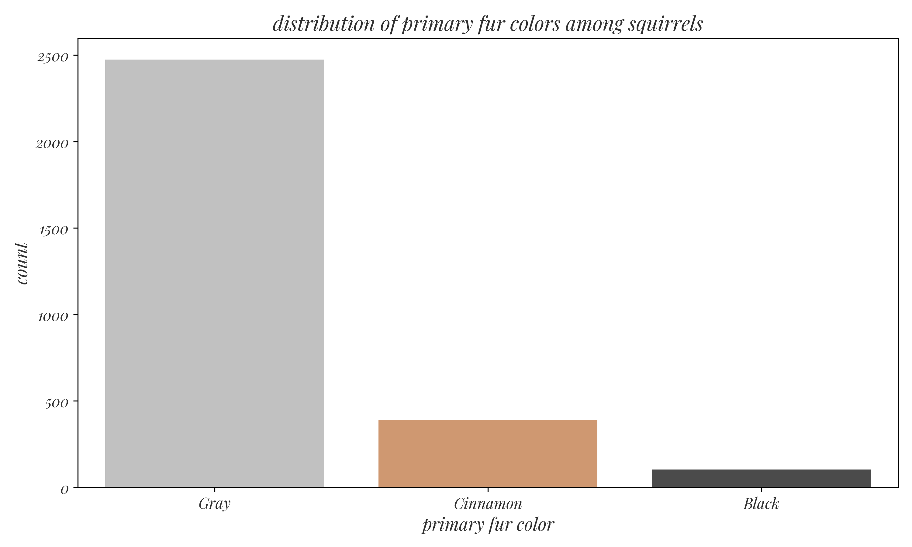
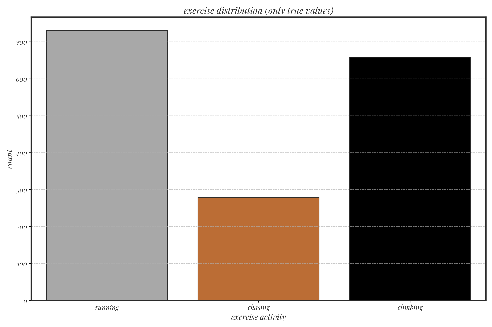
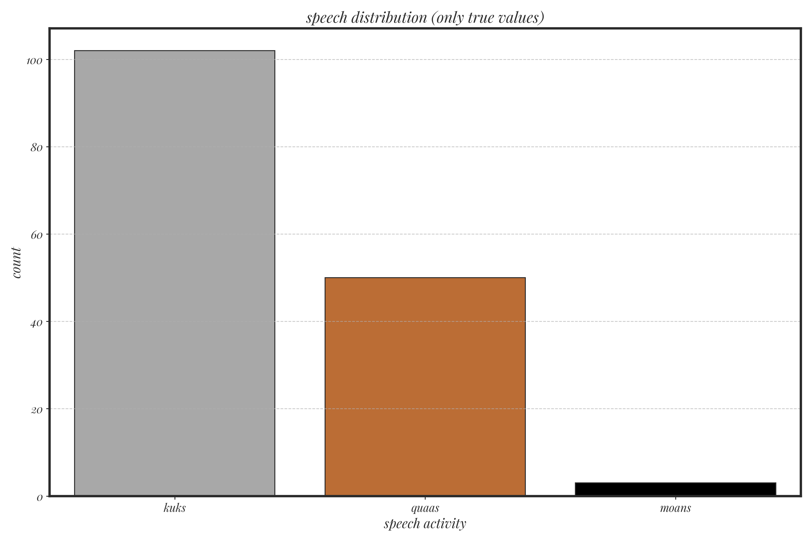
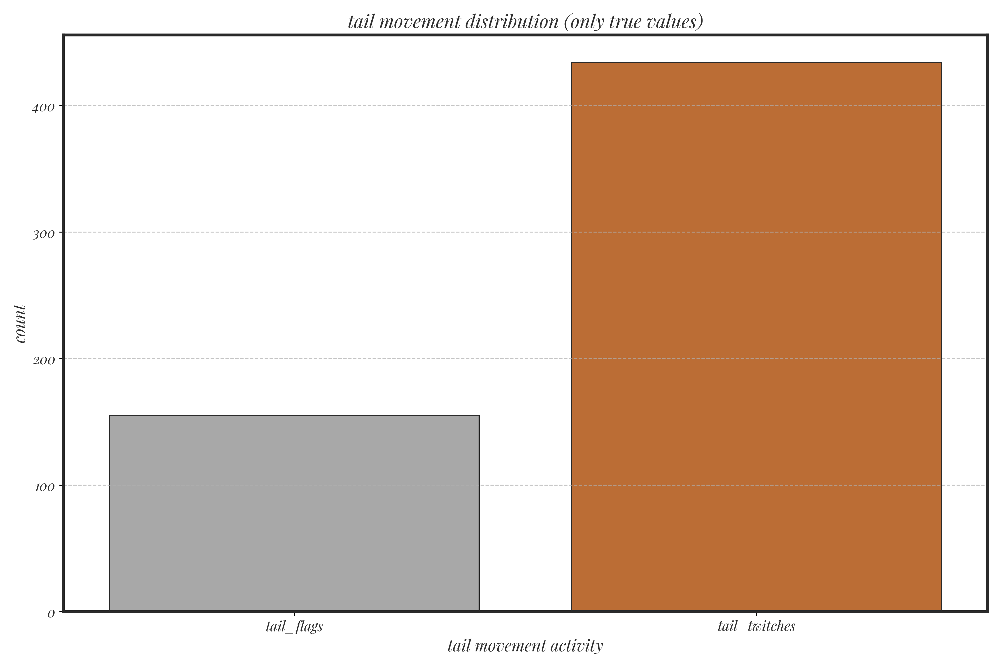

```{r setup, include=FALSE}
library(leaflet)
library(leaflet.extras)
library(leaflet.providers)
library(dplyr)
knitr::opts_chunk$set(echo = TRUE)
```

# Introduction

The goal of this analysis is to research the location, demographics and day-to-day activities of
squirrels in Central Park, NYC through data provided by [The Squirrel Census](https://www.thesquirrelcensus.com/). The data was found
through the NYC open data portal and is super unique, which makes it fun for analysis. The data
was downloaded on 12/13/24. The dataset includes information on squirrel locations, fur colors,
activities, and other anecdotal observations. This report establishes and begins to answer five
exploratory questions through a cartographical, graphical and observational approach. The five
questions that will be explored are:


> This work is inspired by a map titled Squirrel Highways by Dennis Wood, a nondescript map of telephone lines in a suburban neighborhood.


# Methodology

These research questions were picked based on analyzing the raw data. I picked questions that I believed could be answered with the limited data available. The research questions I chose are:

1. What are the concentration patterns of squirrels sightings across Central Park? Where are you
most likely to see a squirrel in central park?
2. What is the distribution of primary fur colors among squirrels? 
3. How do squirrel movement patterns differ between morning (AM) and afternoon (PM) shifts?
4. What are the distributions of common activities observed in squirrels?
5. What unique behaviors and actions are recorded, what are some particularly exceptional
occurrences or behaviors?

To carry out this analysis I have included a series of interactive heatmaps and bar charts. The heatmaps are used to locate the squirrels in central park as well as their temporal patterns and the bar charts are used to asses nominal and binary data.

# Analysis

#### What are the concentration patterns of squirrel sightings across Central Park? Where are you most likely to see a squirrel in central park?

```{r squirrel_concentration_map, echo=FALSE}
# Load the dataset
squirrel_data <- read.csv("location.csv")

# Filter required columns
data_for_map <- squirrel_data %>%
  select(latitude, longitude) %>%
  na.omit()

# Create an interactive leaflet map
leaflet(data = data_for_map) %>%
  addProviderTiles(providers$Stadia.AlidadeSmoothDark, options = providerTileOptions(apiKey = 'd6ac9761-ecc7-41ad-94fa-f24bb7c4bf96')) %>% # Dark basemap
  addHeatmap(
    lng = ~longitude,
    lat = ~latitude,
    blur = 5, # Adjust the blur for smoother heatmap
    max = 2, # Adjust the intensity scale
    radius = 20, # Radius for each point
    gradient = colorNumeric(palette = "magma", domain = NULL) # Use magma color scale
  )
```

By zooming in and out and toying with the above interactive map we can see that certain areas see many squirrels. From a view at a smaller scale we see that squirrels are seen most often in the north and south ends of Central Park and not as much in the center. The most dominant center is in the south. Of course, squirrels are not aquatic so they are generally not found in the water bodies. Despite this there seems to be an abunance of squirrels possibly drinking just north of "The Lake". Zooming in we can see that squirrels are genuinely not seen in the forested regions and more along paths. This begs the question, how much human influence does the squirrel census contain? Would a future study provide better data if squirrels were tagged and tracked via some form of ankle monitor? How much do squirrels travel across the boundary of the park? Squirrels also tend to avoid major man-made structures in the park.

#### What is the distribution of primary fur colors among squirrels?


```{r fur_color_chart, echo=FALSE, fig.align='center', fig.width=8, fig.height=6}

```

We can see that central parks squirrels are mostly of the gray variety, with nearly 2500 subjects. Cinnamon colored squirrels are in the middle with about 500, and black squirrels are probably only a quarter of that number and the rarest variety. Unlike Eau Claire squirrels, white squirrels are not seen in central park.

#### How do squirrel movement patterns differ between morning (AM) and afternoon (PM) shifts?

```{r am_pm_movement_map, echo=FALSE}
# Load the preprocessed temporal data
temporal_data <- read.csv("temporal.csv")

# Filter data for AM and PM
am_data <- temporal_data %>% filter(shift == "AM") %>% select(latitude, longitude)
pm_data <- temporal_data %>% filter(shift == "PM") %>% select(latitude, longitude)

# Create an interactive leaflet map with layer control
leaflet() %>%
  addProviderTiles(providers$Stadia.AlidadeSmoothDark, options = providerTileOptions(apiKey = 'd6ac9761-ecc7-41ad-94fa-f24bb7c4bf96')) %>%
  addHeatmap(data = am_data, group = "AM", lng = ~longitude, lat = ~latitude, blur = 5, max = 2, radius = 20, 
             gradient = colorNumeric(palette = "magma", domain = NULL)) %>%
  addProviderTiles(providers$Stadia.AlidadeSmoothDark, options = providerTileOptions(apiKey = 'd6ac9761-ecc7-41ad-94fa-f24bb7c4bf96')) %>%
  addHeatmap(data = pm_data, group = "PM", lng = ~longitude, lat = ~latitude, blur = 5, max = 2, radius = 20, 
             gradient = colorNumeric(palette = "magma", domain = NULL)) %>%
  addLayersControl(
    baseGroups = c("AM", "PM"),
    options = layersControlOptions(collapsed = FALSE)
  )
```

The heat map shows us that squirrels are seen more during the PM shifts. It seems that squirrels are most commonly spotted at the watering hole just above "The Lake" during the AM shifts. It also seems as if AM squirrels are overall more concentrated that PM squirrels.

#### What are the distributions of common activities observed in squirrels?

```{r exercise distribution chart, echo=FALSE, fig.align='center', fig.width=8, fig.height=6}

```

This chart shows that running and climbing are very common exercises for the squirrels, whereas chasing is less common. It seems that squirrels still very much like to play, and are very active participants in Central Park.

```{r speech distribution chart, echo=FALSE, fig.align='center', fig.width=8, fig.height=6}

```

The speech patterns shown in squirrels were commonly kuks. Quaas were also reasonably common, moans were very uncommon. I wonder if there is any communication between squirrels hidden within this data. Speech was the least common activity seen overall in squirrels. 

```{r tail movement chart, echo=FALSE, fig.align='center', fig.width=8, fig.height=6}

```

Tail movement was pretty common it squirrels, who were often twitching and sometimes flagging. I wonder if the observers of the study ever influenced the tail movement of the squirrels.

#### What unique behaviors and actions are recorded, what are some particularly exceptional occurrences or behaviors?


Some of the unique behaviors that are particularly insteresting or exceptional are the following:

##### Eating food thrown at the squirrel by a Mom and a Baby.
##### Kids trying to poke one squirrel with a stick.
##### Dead.
##### Squirrels fighting pigeons.
##### Multiple squirrels hanging upside down while eating.

Future work on this section could show a word cloud plot and also plot the unique occurances on a interactive map with their description.

# Conclusion

The most satisfying part of this project for me was working with such an intteresting and unique dataset. It was pretty well polished and quite humorous. I like that i could interact and push my skills wihtout working on anything that faced any ethically dilemmas; it let me focus on the code. The most surprising thing I have learned doing this project is how difficult it can be to modify python charts. It is clearly better to do as much creative approach to charts outside of python in a program like Adobe Illustrator if only producing a one off report. The caveat to this would be needing to produce live and repetable charts, it which case I think this exercise does an excellent job of teaching the data scientist how to work with data and design well done graphics.

Some of the specific challenges I overcame in this exercise were:

* Modifying matplotlib to accept non-default fonts.
* Using transparent background that integrate well into documents.
* Finding quality ways to represent unique data fields, I was not able to get my word cloud to work.

The advice I would pass on to the next cohort of students completing one of these projects would be to pick your approach wisely. It can become very easy to get in the weeds in certain aspects of your assignment that end up being a major unproductive time sink.